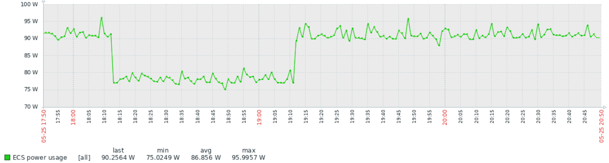
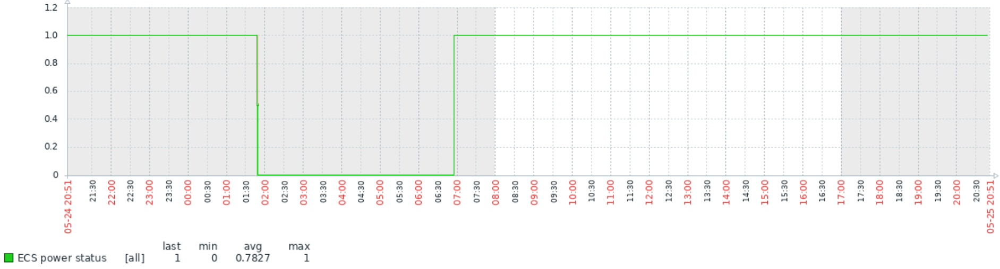

# Zabbix Template: HW myStrom ECS

Monitoring template for [myStrom ECS](https://mystrom.ch/) (Energy Control Switch).

## About

This template access the local API on a single device to collect the power status and usage information.

## Examples

### Power Usage

### Power Status

## Links

* [Support - myStrom WiFi Switch](https://mystrom.ch/support/wifi-switch/)
* [myStrom API Browser](https://api.mystrom.ch/)
